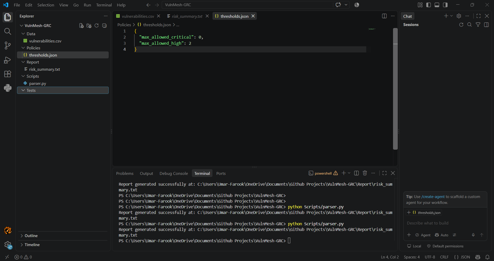

# VulnMesh-GRC

<p align="center">

**Enterprise Vulnerability Governance & Compliance Automation Engine**

A zero-third-party-dependency Python security automation tool designed for vulnerability governance, risk threshold enforcement, audit reporting, and air-gapped environments.

</p>

<p align="center">


</p>

---

## 📌 Project Overview

**VulnMesh-GRC** is an enterprise-oriented Governance, Risk, and Compliance (GRC) automation tool built entirely with the Python standard library.

The project demonstrates how raw vulnerability findings can be transformed into a structured governance decision by applying organizational risk thresholds and automatically generating an audit-oriented security report.

The system is designed with **offline and air-gapped environments** in mind, where installing third-party Python packages may introduce operational, security, or supply-chain concerns.

Instead of relying on external frameworks, VulnMesh-GRC uses Python's built-in modules to provide a lightweight and portable security automation pipeline.

### Core Objective

The primary objective is to automate the following process:

**Vulnerability Data → Risk Evaluation → Governance Decision → Compliance Report**

This reduces manual vulnerability review effort and provides a repeatable process for determining whether an environment remains within its defined risk appetite.

---

# 🏢 Enterprise Use Case

In a typical enterprise environment, vulnerability scanners may generate hundreds or thousands of findings.

Security and GRC teams then need to determine:

- Which vulnerabilities are still active?
- Which findings are critical or high severity?
- How many open critical/high vulnerabilities exist?
- Does the organization exceed its approved risk threshold?
- Should the environment be considered compliant?
- What evidence should be provided during an audit?

VulnMesh-GRC demonstrates an automated approach to answering these questions.

### Example Governance Rule

An organization may define a policy such as:

```text
Maximum Open Critical Vulnerabilities: 0
Maximum Open High Vulnerabilities: 5
```

The engine evaluates the vulnerability dataset against these limits and produces a governance decision.

---

# 🏗️ System Architecture

```text
                         ┌──────────────────────────┐
                         │   Vulnerability Export   │
                         │      CSV Dataset         │
                         └────────────┬─────────────┘
                                      │
                                      ▼
                         ┌──────────────────────────┐
                         │      CSV Parser          │
                         │                          │
                         │  Data Validation         │
                         │  Finding Processing      │
                         └────────────┬─────────────┘
                                      │
                                      ▼
                         ┌──────────────────────────┐
                         │   Risk Classification    │
                         │                          │
                         │  Critical                │
                         │  High                    │
                         │  Medium                  │
                         │  Low                     │
                         └────────────┬─────────────┘
                                      │
                                      ▼
                         ┌──────────────────────────┐
                         │   Governance Engine      │
                         │                          │
                         │  Active Findings         │
                         │  Open Critical           │
                         │  Open High               │
                         │  Threshold Evaluation    │
                         └────────────┬─────────────┘
                                      │
                         ┌────────────┴────────────┐
                         │                         │
                         ▼                         ▼
                ┌─────────────────┐      ┌─────────────────┐
                │   COMPLIANT     │      │  NON-COMPLIANT  │
                └────────┬────────┘      └────────┬────────┘
                         │                        │
                         └────────────┬───────────┘
                                      ▼
                         ┌──────────────────────────┐
                         │     Audit Report         │
                         │                          │
                         │  Risk Summary            │
                         │  Policy Evaluation       │
                         │  Compliance Status       │
                         └──────────────────────────┘
```

---

# 🔄 Risk Evaluation Workflow

```text
             START
               │
               ▼
      Load Vulnerability CSV
               │
               ▼
       Validate Input Data
               │
               ▼
      Load Governance Policy
               │
               ▼
       Filter Active Findings
               │
               ▼
     ┌──────────────────────┐
     │ Evaluate Severity     │
     └──────────┬───────────┘
                │
       ┌────────┴────────┐
       ▼                 ▼
   Critical/High       Other
       │                 │
       ▼                 ▼
 Count Open Risks     Continue
       │
       ▼
 Compare Against
 Policy Thresholds
       │
       ▼
 ┌─────┴─────────────┐
 │                   │
 ▼                   ▼
Within Limits    Exceeds Limits
 │                   │
 ▼                   ▼
COMPLIANT        NON-COMPLIANT
 │                   │
 └─────────┬─────────┘
           ▼
     Generate Report
           │
           ▼
          END
```

---

# 📁 Project Structure

```text
VulnMesh-GRC/
│
├── Assets/
│   └── Screenshots/
│       └── workspace-execution.png
│
├── Data/
│   └── vulnerabilities.csv
│
├── Policies/
│   └── thresholds.json
│
├── Report/
│   └── risk_summary.txt
│
├── Scripts/
│   └── parser.py
│
├── Tests/
│   └── test_parser.py
│
└── README.md
```

### Directory Responsibilities

| Directory | Purpose |
|---|---|
| `Assets/` | Project evidence and screenshots |
| `Data/` | Vulnerability input datasets |
| `Policies/` | Governance and risk threshold configuration |
| `Report/` | Generated security and compliance reports |
| `Scripts/` | Core GRC processing engine |
| `Tests/` | Automated unit tests |
| `README.md` | Technical project documentation |

---

# ⚙️ Core Features

### 1. Zero Third-Party Python Dependencies

VulnMesh-GRC uses only Python's standard library.

Core modules include:

```text
csv
json
argparse
pathlib
unittest
```

This means the project does not require external Python packages such as:

```text
pip install ...
requirements.txt
virtual environments
internet connectivity
```

This design is particularly useful for environments where software installation is heavily restricted.

> Note: Using no third-party Python packages reduces dependency and supply-chain exposure; it does not eliminate vulnerabilities in Python, the operating system, or the underlying infrastructure.

---

### 2. Dynamic Command-Line Interface

The tool supports configurable execution through command-line arguments.

Example:

```powershell
python Scripts/parser.py --data Data/vulnerabilities.csv --policy Policies/thresholds.json --output Report/risk_summary.txt
```

This allows security teams to change:

- Input dataset
- Governance policy
- Report destination

without modifying the source code.

---

### 3. Policy-Based Risk Governance

Risk thresholds are separated from the application logic.

Example:

```json
{
    "max_open_critical": 0,
    "max_open_high": 5
}
```

This separation makes the system easier to maintain because governance requirements can be changed without rewriting the core parser.

---

### 4. Automated Compliance Evaluation

The engine evaluates active vulnerability findings against organizational thresholds.

For example:

```text
Open Critical Findings = 1
Allowed Critical Findings = 0

Result = NON-COMPLIANT
```

Another example:

```text
Open Critical Findings = 0
Open High Findings = 3

Allowed Critical = 0
Allowed High = 5

Result = COMPLIANT
```

---

### 5. Automated Audit Report Generation

The system produces a structured report containing information such as:

```text
Total Findings
Active Findings
Open Critical Findings
Open High Findings
Configured Thresholds
Compliance Status
Risk Evaluation
```

This provides evidence that can be reviewed by security, GRC, or audit teams.

---

# 📊 Example Input

Example vulnerability dataset:

```csv
id,severity,status,title
VULN-001,Critical,Open,Remote Code Execution
VULN-002,High,Open,Outdated Web Server
VULN-003,Medium,Closed,Missing Security Header
VULN-004,High,Open,Weak TLS Configuration
VULN-005,Low,Open,Information Disclosure
```

---

# 🛡️ Example Governance Policy

`Policies/thresholds.json`

```json
{
    "max_open_critical": 0,
    "max_open_high": 5
}
```

This represents an example organizational risk appetite where:

```text
Critical vulnerabilities allowed: 0
High vulnerabilities allowed: 5
```

---

# 📄 Example Generated Report

Example `Report/risk_summary.txt`:

```text
========================================
       VULNMESH-GRC RISK SUMMARY
========================================

Total Findings: 5
Active Findings: 4

Open Critical: 1
Open High: 2
Open Medium: 0
Open Low: 1

----------------------------------------
GOVERNANCE THRESHOLDS
----------------------------------------

Maximum Open Critical: 0
Maximum Open High: 5

----------------------------------------
COMPLIANCE EVALUATION
----------------------------------------

Critical Threshold: EXCEEDED
High Threshold: WITHIN LIMIT

Overall Status: NON-COMPLIANT

----------------------------------------
RISK DECISION
----------------------------------------

Immediate remediation is required for
open critical vulnerability findings.

========================================
```

---

# 💻 Installation

## Requirements

```text
Python 3.x
```

No external packages are required.

Verify Python:

```powershell
python --version
```

or:

```powershell
python3 --version
```

---

# 🚀 Usage

Clone or download the repository:

```powershell
git clone <repository-url>
cd VulnMesh-GRC
```

Run the default configuration:

```powershell
python Scripts/parser.py
```

Run with custom parameters:

```powershell
python Scripts/parser.py `
    --data Data/vulnerabilities.csv `
    --policy Policies/thresholds.json `
    --output Report/risk_summary.txt
```

---

# 🧪 Testing

VulnMesh-GRC includes automated unit testing using Python's built-in `unittest` framework.

Run:

```powershell
python -m unittest Tests/test_parser.py
```

Expected result:

```text
.....
----------------------------------------------------------------------
Ran 5 tests in 0.00s

OK
```

The test suite validates important governance branches including:

```text
✓ Critical vulnerability threshold handling
✓ High vulnerability threshold handling
✓ Compliant scenarios
✓ Non-compliant scenarios
✓ Risk evaluation logic
```

---

# 🔐 Security Considerations

VulnMesh-GRC was designed with security-conscious deployment scenarios in mind.

### Air-Gapped Compatibility

The application does not require an internet connection or external package repository during execution.

This makes it suitable for environments such as:

```text
Security Operations
Industrial Networks
Restricted Enterprise Networks
Defense Environments
Critical Infrastructure Labs
Offline Assessment Environments
```

---

### Reduced Dependency Exposure

The project intentionally avoids third-party Python packages.

Advantages include:

```text
Reduced dependency management
Reduced third-party package exposure
Simpler deployment
Easier offline installation
Smaller software footprint
```

---

### Configuration Separation

Governance thresholds are stored separately from application code.

```text
Policies/
└── thresholds.json
```

This makes policy changes easier to audit and reduces the need to modify application logic.

---

### Input Handling

The parser should treat imported vulnerability data as untrusted input.

Recommended production controls include:

```text
Input schema validation
Malformed CSV detection
Unexpected severity handling
Unexpected status handling
File permission controls
Output directory protection
```

---

### Report Integrity

For a production implementation, generated reports could be further protected using:

```text
SHA-256 hashing
Digital signatures
Immutable storage
Access control
Centralized audit logging
Timestamped reports
```

These capabilities can be added as future extensions.

---

# 🧩 Technology Stack

| Technology | Purpose |
|---|---|
| Python 3.x | Core programming language |
| `csv` | Vulnerability dataset parsing |
| `json` | Policy configuration |
| `argparse` | CLI interface |
| `pathlib` | File and path management |
| `unittest` | Automated testing |
| PowerShell | Windows CLI execution |
| Git | Version control |
| GitHub | Source control and portfolio presentation |

---

# 📈 Risk Governance Model

The current implementation follows a simple threshold-based model.

```text
                Vulnerability Finding
                         │
                         ▼
                  Is it Active?
                    /       \
                  No         Yes
                  │           │
                  ▼           ▼
               Ignore      Severity
                              │
                 ┌────────────┼────────────┐
                 ▼            ▼            ▼
             Critical        High       Other
                 │            │            │
                 ▼            ▼            ▼
              Count        Count       Track
                 │            │
                 └─────┬──────┘
                       ▼
                Compare Policy
                       │
                       ▼
               Governance Decision
```

The architecture can later be extended into more advanced risk scoring models involving:

```text
CVSS
Asset Criticality
Exploitability
Business Impact
Exposure
Compensating Controls
Regulatory Requirements
Risk Acceptance
Remediation SLA
```

---

# 🏭 Enterprise Extension Roadmap

The current project provides a foundation for a larger GRC automation platform.

Potential future capabilities include:

### Phase 1 — Current

```text
✓ CSV vulnerability ingestion
✓ Policy configuration
✓ Risk threshold evaluation
✓ CLI automation
✓ Automated testing
✓ Text-based reporting
```

### Phase 2 — Security Engineering

```text
□ CVSS-based scoring
□ Asset criticality weighting
□ Risk prioritization
□ Remediation SLA tracking
□ Hash-based report integrity
□ Structured JSON reporting
```

### Phase 3 — Enterprise GRC

```text
□ Vulnerability scanner integrations
□ SIEM integration
□ REST API
□ Role-based access control
□ Audit trail
□ Risk acceptance workflow
□ Compliance framework mapping
```

### Phase 4 — Advanced Governance

```text
□ ISO 27001 control mapping
□ NIST CSF mapping
□ NIST 800-53 mapping
□ CIS Controls mapping
□ Automated evidence collection
□ Executive dashboards
□ Risk trend analysis
```

---

# 📚 Potential Compliance Mapping

The architecture can be extended to support governance frameworks such as:

```text
ISO/IEC 27001
NIST Cybersecurity Framework
NIST SP 800-53
CIS Controls
SOC 2
PCI DSS
```

The current project should be considered an **automation foundation**, not a certified compliance solution.

Actual compliance depends on organizational controls, evidence, procedures, scope, and audit requirements.

---

# 🎯 Skills Demonstrated

This project demonstrates practical knowledge in:

```text
Governance, Risk & Compliance
Vulnerability Management
Risk Assessment
Security Automation
Python Programming
CLI Tool Development
Policy-as-Code Concepts
Security Data Processing
Automated Testing
Secure Software Design
Air-Gapped Deployment Concepts
Audit Reporting
Enterprise Security Architecture
```

---

# 🧠 Why This Project Matters

Traditional vulnerability management often involves manually reviewing scanner exports, filtering findings, checking organizational thresholds, and preparing reports.

VulnMesh-GRC demonstrates how this workflow can be converted into a repeatable automation pipeline.

The important concept is not simply parsing a CSV file.

The project demonstrates the transition from:

```text
Raw Security Data
        ↓
Security Analysis
        ↓
Risk Decision
        ↓
Governance Policy
        ↓
Compliance Status
        ↓
Audit Evidence
```

This is the type of workflow commonly found at the intersection of **cybersecurity engineering and GRC**.

---

# 📸 Project Evidence

The repository includes visual evidence of the development environment and CLI execution.



The screenshot demonstrates:

```text
Project structure
CLI execution
Policy configuration
Application output
Development environment
```

---

# 🧪 Validation Checklist

Before considering the project ready for portfolio demonstration:

```text
[✓] Python application executes successfully
[✓] CSV input loads correctly
[✓] JSON policy loads correctly
[✓] Risk thresholds are evaluated
[✓] Compliance status is generated
[✓] Report file is generated
[✓] Unit tests execute successfully
[✓] No third-party dependencies required
[✓] Project structure is documented
[✓] Screenshot evidence included
```

---

# ⚠️ Limitations

This project is intentionally designed as a portfolio and engineering demonstration.

It currently does not provide:

```text
Real-time vulnerability scanning
Direct integration with commercial scanners
Multi-user authentication
Database persistence
Web dashboard
Distributed processing
Formal compliance certification
Automated remediation
```

These limitations provide opportunities for future development.

---

# 🔮 Future Vision

The long-term goal is to evolve VulnMesh-GRC from a command-line prototype into a lightweight enterprise security governance platform capable of connecting vulnerability intelligence with organizational risk policies.

Potential architecture:

```text
Vulnerability Scanners
        │
        ▼
Data Ingestion Layer
        │
        ▼
Normalization Engine
        │
        ▼
Risk Analysis Engine
        │
        ├──────────────► Asset Risk
        │
        ├──────────────► CVSS Risk
        │
        ├──────────────► Business Impact
        │
        └──────────────► Compliance Controls
                         │
                         ▼
                   GRC Decision Engine
                         │
              ┌──────────┴──────────┐
              ▼                     ▼
        Risk Dashboard         Audit Evidence
```

---

# 👨‍💻 Portfolio Project

**VulnMesh-GRC** was developed as a cybersecurity engineering and GRC portfolio project to demonstrate practical implementation of:

**Vulnerability Management + Risk Governance + Security Automation + Compliance Reporting**

The project focuses on building a small but extensible security automation engine using only Python's standard library.

---

# 📜 License

This project is open-source and intended for educational, research, and professional portfolio demonstration.

See the repository license for applicable terms.

---

# ⭐ Project Highlights

```text
┌──────────────────────────────────────────────┐
│              VULNMESH-GRC                    │
├──────────────────────────────────────────────┤
│                                              │
│  ✓ Zero Third-Party Python Dependencies      │
│  ✓ Air-Gapped Friendly Architecture          │
│  ✓ Policy-Based Risk Governance               │
│  ✓ Automated Compliance Evaluation            │
│  ✓ CLI-Based Security Automation              │
│  ✓ Automated Unit Testing                     │
│  ✓ Audit-Oriented Reporting                   │
│  ✓ Enterprise Extension Roadmap               │
│                                              │
└──────────────────────────────────────────────┘
```

**VulnMesh-GRC — Turning vulnerability data into actionable governance decisions.**